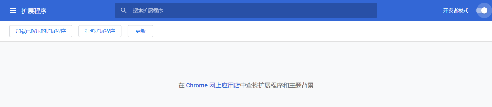
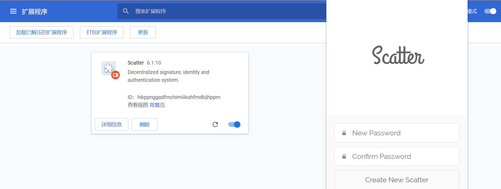
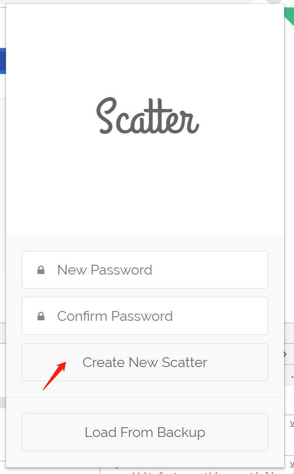
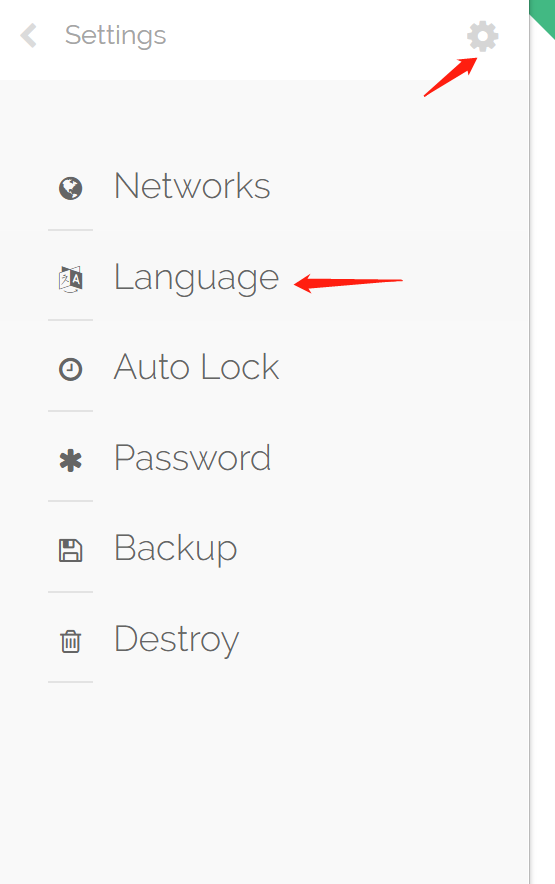
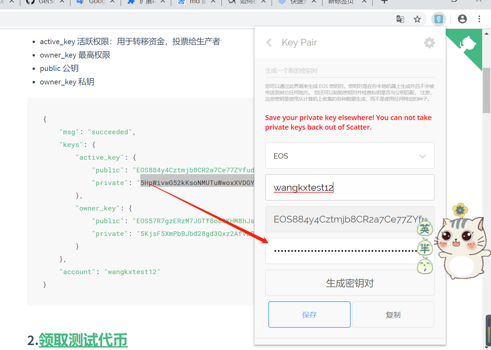

# 创建测试账户

## 1.[使用麒麟测试网创建账户](https://kylin.eosx.io/tools/account/create)  {docsify-ignore}

使用`wangkxtest12`创建账户名,昵称要求必须`12`位字符串，包含`a-z`字母和`1-5`数字组合方可有效

```URL
http://faucet.cryptokylin.io/create_account?wangkxtest12
```

注册成功窗口显示如下：

* active_key 活跃权限：用于转移资金，投票给生产者
* owner_key 最高权限
* public 公钥
* owner_key 私钥

```javascript
{
    "msg": "succeeded", 
    "keys": {
        "active_key": {
            "public": "EOS884y4Cztmjb8CR2a7Ce77ZYfudFAewmsRXYFWwbRscAbrMAEQg", 
            "private": "5HpWivwG52kKsoNMUTuWwoxXVDGYK312FSh214iNLyZn97cRWb2"
        }, 
        "owner_key": {
            "public": "EOS57R7gzERzM7JGTf8o83KHM8hJsbCEm3vSbkYRp17VwAa5FuTKu", 
            "private": "5KjsF5XmPbBJbd28gd3Qxz2AfvaPzSMCqhiVpPLnn8tUMSY7bye"
        }
    }, 
    "account": "wangkxtest12"
}
```

## 2.[领取测试代币](http://faucet.cryptokylin.io/get_token?valid_account_name)  {docsify-ignore}

使用`wangkxtest12`账户领取代币，将`wangkxtest12`替换`URL valid_account_name`字段

```URL
http://faucet.cryptokylin.io/get_token?wangkxtest12
```

领取成功显示：
```javascript
{"msg": "succeeded"}
```

## 3.下载scatter chrome扩展插件，并导入chrome浏览器  {docsify-ignore}

scatter.zip下载地址已托管百度网盘地址
```text
链接：https://pan.baidu.com/s/1LvfJZZ88LdHIQTfspo7hkA 
提取码：shzh 
复制这段内容后打开百度网盘手机App，操作更方便哦
```


* chrome浏览器地址栏输入：`chrome://extensions/`
* 开启，`开发者模式`



* 点击`加载已解压的扩展程序`



## 4.创建钱包密码   {docsify-ignore}

* 例：输入两次`12345678`为密码(`8位`)，创建钱包



## 5.切换中文语言，点击齿轮，language设置进入切换中文保存  {docsify-ignore}



## 6.新建密钥对 导入active_key活跃权限私钥   {docsify-ignore}

